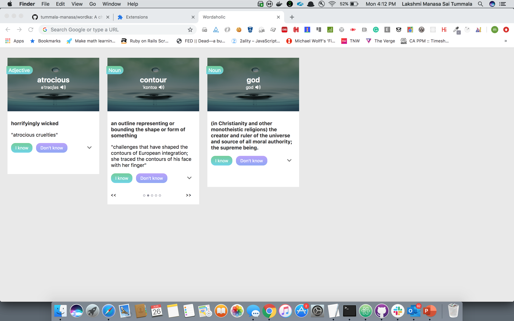

### Worka
A Chrome extension which shows new word meanings every time user opens a new tab.

### Run
Import the folder in the chrome extension developer option and turn it on. When you open a new tab, you will get to see the new words.

### App functionality

- In this application, show around 3 or 5 words per day. Once user open a new tab we check for the date and show new meanings if the date changed.
- Basic meaning is shown by default. On click the arrow(down-arrow), more details are shown.
- If word had more meanings, a carouself of meanings is shown.

### Sample

